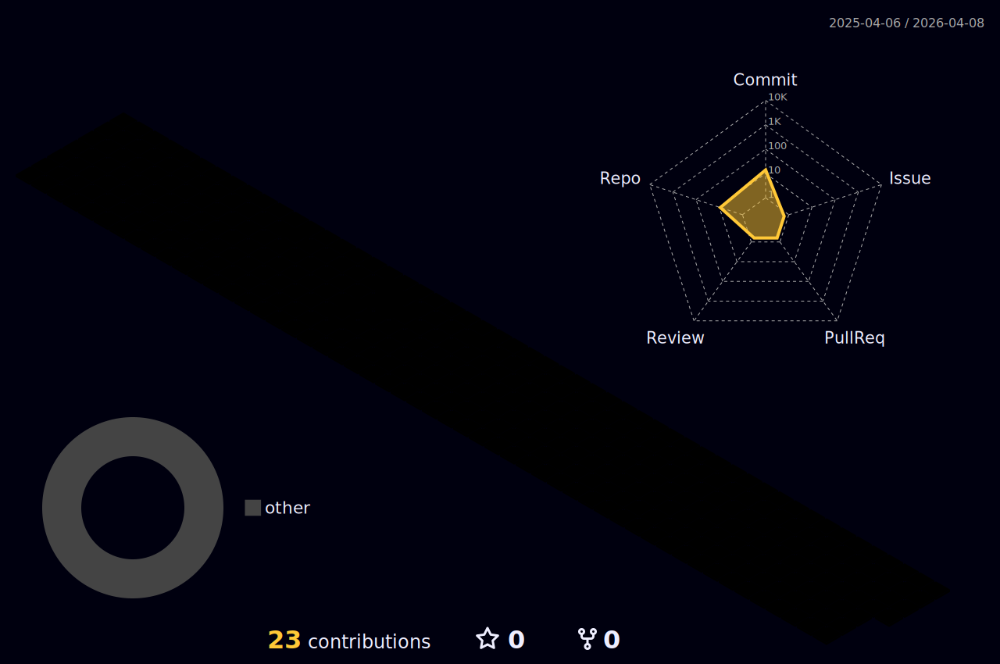

# 👨‍🎓 About Me
🎓 Sinh viên **Kỹ thuật Điều khiển & Tự động hóa – HUST**  
🛡️ Chứng chỉ: **CCNA | CEH | OSCP (PEN-200)**  
⚡ Đam mê **IoT, Robotics, Embedded Systems, Automation & Cybersecurity**  
🧠 Tư duy: *"Think like an Engineer, Act like a Hacker"*  

---

## 🛠️ Cyber Skills & Tools

### 🔒 Cybersecurity

  
  
  

  

---

### ⚙️ Automation & Control Engineering

  

- ⚡ Điều khiển tự động, PLC, Robotics  
- ⚡ Hệ thống nhúng & IoT  
- ⚡ VMware, vSphere, Windows Server Configuration  
- ⚡ AI & Automation 4.0  

---

## 📊 Hacker Stats

  
  

---

## 🌀 3D Contribution Graph

  

---

## 🐍 Cyber Snake

  

---

## 🌐 Contact Me

  
  
  

---

⭐️ *Sinh viên Tự động hóa HUST – kết hợp Điều khiển, Tự động hóa và An ninh mạng để hướng tới Công nghiệp 4.0!* ⭐️
